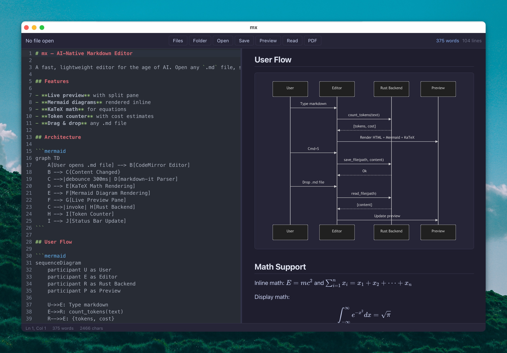

# Kaelio

Kaelio is a fast, lightweight desktop Markdown editor and project file reader built with Tauri 2, Rust, and vanilla TypeScript.

It began as a fork of [mx](https://github.com/vibery-studio/mx) by Vibery Studio and now continues as a rebranded Kaelio project with a new app identity, new icon, expanded project browsing, richer preview/export behavior, and Git-backed writing workflows.



## Status

Current version: **0.9.1**.

Kaelio is usable for daily Markdown and project-note work, but it is still early in its own roadmap. Some export and broader file-preview features are actively evolving.

## Original Project Credit

Kaelio is derived from **mx**, an open-source Markdown editor by Vibery Studio.

- Original repository: [github.com/vibery-studio/mx](https://github.com/vibery-studio/mx)
- Original website: [getmx.vibery.app](https://getmx.vibery.app/)
- Upstream license: GPL-3.0

This repository keeps that attribution while treating Kaelio as a new app direction with its own name, bundle identifier, updater endpoint, branding, and feature roadmap.

## What Kaelio Is For

Kaelio is designed for opening a folder and quickly reading, editing, previewing, exporting, and syncing project notes or lightweight documents without opening a full IDE.

Good fits:

- Markdown notes, docs, READMEs, specs, journals, and project knowledge bases.
- Project folders with mixed text, Markdown, JSON, CSV, HTML, SVG, PDF, and image files.
- Writing that needs live preview, Mermaid diagrams, KaTeX math, callouts, checklists, and frontmatter.
- Git-backed writing where saves can become commits and remote sync can happen in the background.

Not the goal:

- Kaelio is not a VS Code replacement.
- Kaelio is not a full programming IDE.
- Kaelio is not yet a complete universal file renderer.

## Features

### Markdown Editing

- CodeMirror 6 editor with syntax highlighting, line numbers, undo/redo history, search, and replace.
- Live split preview with editor-only and preview-only/read modes.
- Editor ↔ preview scroll sync (toolbar toggle) and click-in-preview to jump the editor cursor to that line.
- Formatting toolbar for common Markdown actions.
- Word, character, and line counts.
- Auto-save, crash recovery, and local snapshots.
- Multiple tabs with preserved editor state.
- Customizable keyboard shortcuts with conflict detection.

### Rich Preview

- Markdown rendering with `markdown-it`.
- Mermaid diagrams, including click-to-zoom viewing.
- KaTeX math rendering.
- YAML frontmatter rendered as a metadata table.
- Obsidian-style callouts.
- Interactive task checklists that update the source.
- Footnotes, tags, wikilinks, headings, anchors, and formatted HTML copy.
- Custom preview CSS from `~/.kaelio/preview.css`.

### Project Explorer

- Folder explorer with expandable directories.
- File badges and status indicators.
- File and folder creation, rename, duplicate, delete, reveal, and copy path actions.
- File search and content search.
- Sidebar resizing and explorer text-size settings.
- Session restore for the last folder, file, tabs, and UI state.

### File Viewing

- Markdown, text, and code-like files open in the editor.
- HTML renders in a sandboxed preview frame.
- JSON renders as a pretty preview.
- CSV renders as a table preview.
- SVG, images, and PDFs open in preview mode.
- Binary/media files are guarded from accidental text editing.

### Git Sync

- Git repository detection and branch/status display.
- One-click sync setup from a remote URL.
- Manual commit, push, pull, stage, discard, and file history actions.
- Optional auto-sync on save with background commit and push.
- Pull on folder open when auto-sync is enabled.
- SSH agent, SSH key, and HTTPS credential-helper support.
- Conflict detection with a side-by-side resolver.
- Version history from Git commits plus local snapshots.

### Export

Kaelio has two export paths:

- Preview exports: PNG, JPG, PDF, and DOCX capture the rendered preview so the output matches what is visible in the app.
- Markdown/HTML exports: rendered HTML can be saved with Kaelio styling, callouts, and tag styles.

The Rust backend also includes Pandoc-based PDF/DOCX commands and bundles export sidecars for app builds:

- `src-tauri/binaries/pandoc-*`
- `src-tauri/binaries/typst-*`

Pandoc is used by the backend export pipeline and remains part of Kaelio's document-export foundation. The current UI favors preview-faithful export for PDF/DOCX, while the Pandoc/Typst path remains available for structured document export work.

### Native App

- Tauri 2 desktop app with Rust-powered file, Git, export, watcher, updater, and system commands.
- Native menu integration.
- Auto-update support through GitHub Releases.
- macOS, Windows, and Linux bundle targets.
- File associations for Markdown, YAML, text, JSON, CSV, HTML, SVG, and common image formats.
- Rebranded product name, bundle identifier, app icon, and updater endpoint for Kaelio.

## Repository Structure

```text
.
|-- src/                 # Vanilla TypeScript frontend
|   |-- main.ts          # Editor, preview, explorer, Git UI, export UI, app state
|   `-- styles.css       # Themes, layout, editor, preview, dialogs
|-- src-tauri/           # Tauri 2 Rust backend
|   |-- src/lib.rs       # IPC commands for files, export, Git, snapshots, watchers, updater menus
|   |-- Cargo.toml       # Rust package metadata and backend dependencies
|   |-- tauri.conf.json  # App identity, bundle, updater, file associations, sidecars
|   `-- binaries/        # Bundled Pandoc/Typst sidecar binaries
|-- docs/                # Technical architecture notes
|-- .github/workflows/   # Release workflow
|-- index.html           # App shell
|-- package.json         # Frontend dependencies and scripts
`-- vite.config.ts       # Vite dev/build config
```

## Development

Requirements:

- Node.js and npm
- Rust and Cargo
- Tauri system prerequisites for your platform
- macOS Command Line Tools or Xcode tools on macOS

Install dependencies:

```bash
npm install
```

Run the app in development:

```bash
npm run tauri dev
```

Build the frontend:

```bash
npm run build
```

Build the app bundle:

```bash
npm run tauri build
```

Build a debug bundle:

```bash
npm run tauri -- build --debug
```

Vite runs on port `1420` in development, with HMR on `1421`.

## Keyboard Shortcuts

| Shortcut | Action |
|----------|--------|
| `Cmd+O` | Open file |
| `Cmd+S` | Save file |
| `Cmd+N` | New file |
| `Cmd+P` | Show/hide preview |
| `Cmd+E` | Reading view |
| `Cmd+B` | Show/hide explorer |
| `Cmd+F` | Search in file |
| `Cmd+H` | Search and replace |
| `Cmd+Shift+P` | Command palette |
| `Cmd+Shift+F` | File search |
| `Cmd+Opt+F` | Content search |
| `Cmd+Shift+C` | Copy formatted HTML |
| `Cmd+Shift+N` | New window |
| `Cmd+W` | Close tab |
| `Cmd+=` / `Cmd+-` | Zoom in / out |

## Release

The release workflow is defined in `.github/workflows/release.yml`.

Pushing a `v*` tag builds platform artifacts, signs updater assets, creates a GitHub Release, and publishes `latest.json` for the in-app updater.

## Technical Docs

| Doc | Description |
|-----|-------------|
| [00-architecture-overview](docs/00-architecture-overview.md) | System shape, tech stack, entry points |
| [01-editor-engine](docs/01-editor-engine.md) | CodeMirror setup and keybindings |
| [02-preview-pipeline](docs/02-preview-pipeline.md) | markdown-it, KaTeX, Mermaid, frontmatter, callouts |
| [03-file-operations](docs/03-file-operations.md) | Rust commands and file I/O |
| [04-pdf-export](docs/04-pdf-export.md) | Pandoc, Typst, Mermaid, and export pipeline notes |
| [05-ui-layout](docs/05-ui-layout.md) | UI layout, theme, and view modes |
| [06-auto-update](docs/06-auto-update.md) | In-app auto-update system |
| [07-release-pipeline](docs/07-release-pipeline.md) | CI/CD, signing, and release process |

## License

Kaelio is licensed under [GPL-3.0](LICENSE), preserving the license of the upstream mx project.
