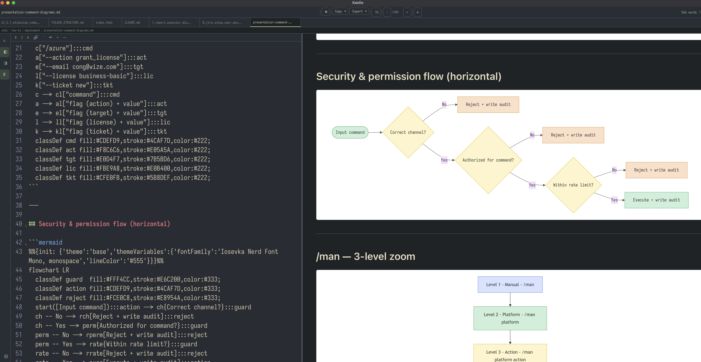
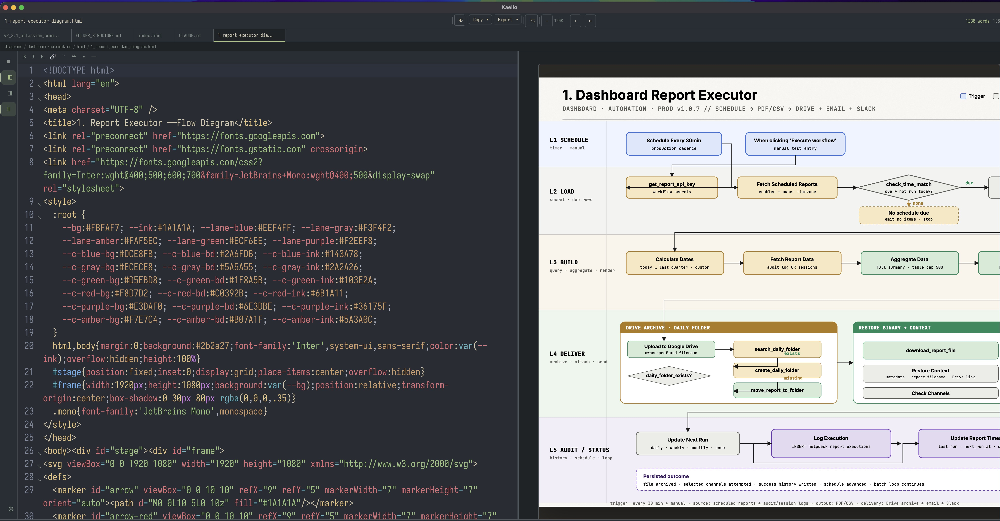

# Kaelio

**Friendly AI-generated, human-reading.**

A fast, lightweight Markdown editor built with Tauri 2 + Rust. Open any `.md` file and get live preview, Mermaid diagrams, math, and Git-backed history — no vault, no config, just open and go.




## Why Kaelio

- ⚡ **Renders everything inline** — Mermaid diagrams, KaTeX math, callouts, and tables in a live split preview.
- 📖 **Built for reading** — soft-wrap modes, zen mode, themes, custom fonts/sizes, and zoom keep long docs comfortable.
- 🪟 **Two docs at once** — split view with a second editable pane, plus file comparison side by side.

Kaelio is a fork of [mx](https://github.com/vibery-studio/mx) (GPL-3.0), continuing it with a split editor, file compare, soft wrap, and reading polish.

## ✨ New in Kaelio (beyond mx)

| Feature | What it does |
|---------|--------------|
| **Split view** | Toggle a second pane (`⊟`) beside the editor — a full editor with its own tabs and edit/preview toggle. `Cmd+S` saves whichever pane has focus. |
| **File compare** | Right-click → *Open in Split Window*, or *Select for Compare* → *Compare with Selected* to view two files side by side. |
| **Soft wrap** | View → Soft Wrap: Off, Window Width, or Page Guide (a configurable guide column) — long lines stop clipping. |
| **Preview search** | `Cmd+F` in reading view highlights matches with next/prev navigation. |
| **Session restore** | Reopens your tabs with scroll and cursor positions on launch. |
| **Custom themes** | Built-in Everforest and Nord themes plus your own custom theme — beyond mx's stock palette. |
| **Custom fonts & sizes** | Pick your reading font and size, and zoom each split pane independently. |
| **HTML rendering** | Open and render `.html` files inline in the preview pane. |

Plus the full mx toolkit: Mermaid & KaTeX, Git sync, callouts, command palette, zoom, and PDF/DOCX export.

## Features

- **Editor** — live split preview, multiple tabs, code folding, formatting toolbar, search & replace (`Cmd+F`/`Cmd+H`), line numbers, soft wrap.
- **Markdown** — Mermaid (click-to-zoom), KaTeX (`$…$`, `$$…$$`), YAML frontmatter, footnotes, wikilinks, anchor navigation, copy-heading-link.
- **Files** — sidebar browser, context menu, file search (`Cmd+Shift+F`), content search (`Cmd+Opt+F`), command palette, breadcrumbs, drag & drop, recent files.
- **Git sync** — one-click setup, auto commit+push on save, auto-pull on open, conflict resolution, per-file history & snapshots, status dots.
- **Obsidian-style** — callouts (`> [!tip]`), interactive checklists, tag pills, wikilinks.
- **Writing** — auto-save, crash recovery, 60s version snapshots, external-change detection, zen mode, image paste & lightbox.
- **Export** — copy as formatted HTML / raw / plain; image & PDF from the preview (PNG/JPG/PDF); Markdown to PDF/DOCX via Pandoc + Typst.
- **Platform** — multiple windows, real-time word/char count, weekly auto-update, file associations, macOS / Windows / Linux.

## Download

Grab the latest build from the [Releases page](https://github.com/kael-wanderer/kaelio/releases).

> **macOS:** if you see *"Kaelio is damaged and can't be opened"* (Gatekeeper blocks unsigned apps), run:
> ```
> xattr -cr /Applications/Kaelio.app
> ```

## Keyboard Shortcuts

| Shortcut | Action |
|----------|--------|
| `Cmd+O` / `Cmd+S` / `Cmd+N` | Open / Save / New file |
| `Cmd+P` / `Cmd+E` | Toggle preview / Reading view |
| `Cmd+B` | Toggle sidebar |
| `Cmd+F` / `Cmd+H` | Search / Search & replace |
| `Cmd+Shift+P` | Command palette |
| `Cmd+Shift+F` / `Cmd+Opt+F` | File search / Content search |
| `Cmd+Shift+Z` | Zen mode |
| `Cmd+Shift+N` / `Cmd+W` | New window / Close tab |
| `Cmd+=` / `Cmd+-` | Zoom in / out |

## Development

Requires Node.js 18+, Rust, and the [Tauri prerequisites](https://tauri.app/start/prerequisites/).

```bash
npm install
npm run tauri dev      # dev server + hot reload
npm run tauri build    # production bundle
```

### Markdown PDF / DOCX export — requirements

The **Markdown → PDF / DOCX** export uses [Pandoc](https://pandoc.org). It is not
bundled, so install it (and a PDF engine) once:

```bash
brew install pandoc   # required for PDF and DOCX
brew install typst    # PDF engine (lightweight, ~25 MB) — recommended
```

Kaelio renders Markdown PDF with Typst, so `pandoc` + `typst` is all you need.
A full TeX install (`brew install --cask mactex-no-gui`, ~6.9 GB) is not
required.

The **HTML → PNG / JPG / PDF** export captures the live preview and needs no extra install.

## License

GPL-3.0, inherited from [mx](https://github.com/vibery-studio/mx) by Vibery Studio.
