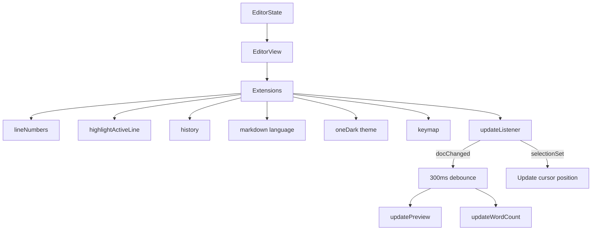

# 01-editor-engine

CodeMirror 6 powers the markdown editor with syntax highlighting, line numbers, history, and custom keybindings. All editor configuration lives in `src/main.ts`.

## System Diagram

## 1. Extensions

| Extension | Source | Purpose |
|-----------|--------|---------|
| `lineNumbers()` | @codemirror/view | Line gutter |
| `highlightActiveLine()` | @codemirror/view | Current line highlight |
| `history()` | @codemirror/commands | Undo/redo |
| `bracketMatching()` | @codemirror/language | Match brackets |
| `closeBrackets()` | @codemirror/autocomplete | Auto-close brackets |
| `markdown()` | @codemirror/lang-markdown | Markdown syntax + code language nesting |
| `oneDark` | @codemirror/theme-one-dark | Dark color scheme |
| `editorFillTheme` | custom | Fill container height |

## 2. Keybindings

| Key | Action |
|-----|--------|
| `Cmd+O` | Open file dialog |
| `Cmd+S` | Save file |
| `Cmd+P` | Toggle preview |
| `Cmd+B` | Toggle sidebar |
| `Cmd+E` | Toggle read mode |
| `Tab` | Indent with tab |

## 3. Content Change Flow

Editor dispatches `updateListener` on every change. If `docChanged`, a 300ms debounce triggers `updatePreview()` and `updateWordCount()`. Cursor position updates immediately on any selection change.

## 4. Soft Wrap

The editor supports three wrap modes via **View → Soft Wrap**, applied through a CodeMirror `Compartment` (`lineWrapCompartment`, mirroring `lineNumbersCompartment`):

| Mode | Behavior |
|------|----------|
| Off | No wrapping; long lines scroll horizontally |
| Window Width | `EditorView.lineWrapping` — wraps at the pane edge, reflows on resize |
| Column (80) | `EditorView.lineWrapping` + `max-width: 80ch` on `.cm-content`, with a faint vertical guide line drawn at column 80 |

State persists in localStorage as `kaelio-wrap-mode` (default `window`). `setWrapMode()` reconfigures the compartment and toggles the `.wrap-column` class + `--wrap-col` custom property on `#editor-wrapper`.

## File Reference

| File | Purpose |
|------|---------|
| `src/main.ts:550-583` | EditorView creation with all extensions |
| `src/main.ts:179-188` | `onContentChange()` debounce handler |
| `src/main.ts:286-289` | `editorFillTheme` custom theme |

## Cross-References

| Doc | Relation |
|-----|----------|
| [00-architecture-overview](00-architecture-overview.md) | System context |
| [02-preview-pipeline](02-preview-pipeline.md) | Receives content changes |
| [05-ui-layout](05-ui-layout.md) | Editor pane layout |
