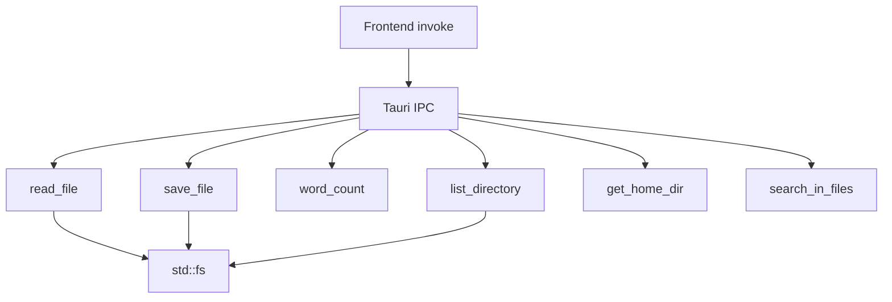

# 03-file-operations

Rust backend exposes Tauri commands for reading files, saving files, listing directories, and counting words. All file I/O goes through `std::fs`. Frontend calls these via `invoke()`.

## System Diagram

## 1. Tauri Commands

| Command | Input | Output | Purpose |
|---------|-------|--------|---------|
| `read_file` | `path: String` | `FileInfo { path, content, size }` | Read file + metadata |
| `save_file` | `path: String, content: String` | `()` | Write content to path |
| `word_count` | `text: String` | `WordCount { chars, words, lines }` | Count chars/words/lines |
| `list_directory` | `path: String` | `Vec<DirEntry>` | List directory entries |
| `get_home_dir` | none | `String` | Return `$HOME` |
| `search_in_files` | `folder_path: String, query: String` | `Vec<SearchResult>` | Case-insensitive filename matches first, then content search across `.md`/`.markdown`/`.txt` files |

## 2. Sidebar Search

`search_in_files` recursively walks the folder, returns filename matches across all non-ignored files first, then reads each eligible content file and searches line-by-line for the query string (case-insensitive). Content search is limited to `.md`, `.markdown`, and `.txt` files up to 1MB. Returns up to 200 `SearchResult` items with:

| Field | Type | Description |
|-------|------|-------------|
| `result_type` | `String` | `filename` or `content` |
| `file_path` | `String` | Absolute path to the file |
| `line_number` | `usize` | 1-based line number for content matches, `0` for filename matches |
| `line_content` | `String` | Full text of the matched line for content matches |
| `match_start` | `usize` | Character offset of match start within the line or filename |
| `match_end` | `usize` | Character offset of match end within the line or filename |

Skips: `node_modules`, `.git`, `target`, `.DS_Store`, `__pycache__`. Ignores files larger than 1 MB.

## 3. Directory Listing

`list_directory` filters dotfiles, sorts directories first then alphabetically (case-insensitive). Returns `DirEntry` with `name`, `path`, `is_dir`, `extension`.

## 4. Frontend File Flow

| Action | Trigger | Dialog |
|--------|---------|--------|
| Open file | `Cmd+O` or toolbar | `@tauri-apps/plugin-dialog` open |
| Save file | `Cmd+S` or toolbar | Save-as dialog if no current path |
| Drop file | Drag `.md` onto window | None (Tauri drag-drop event) |
| Browse folder | Toolbar "Folder" button | None (loads sidebar) |

## 5. State Tracking

`currentFilePath` tracks the open file. `isModified` flips to `true` on any content change, resets on save. The modified indicator (`●`) shows in the toolbar.

## File Reference

| File | Purpose |
|------|---------|
| `src-tauri/src/lib.rs:28-42` | `read_file`, `save_file` |
| `src-tauri/src/lib.rs:44-51` | `word_count` |
| `src-tauri/src/lib.rs:53-83` | `list_directory` |
| `src/main.ts:130-175` | Frontend file open/save logic |
| `src/main.ts:273-282` | Drag-and-drop handler |

## Cross-References

| Doc | Relation |
|-----|----------|
| [00-architecture-overview](00-architecture-overview.md) | IPC model |
| [05-ui-layout](05-ui-layout.md) | Sidebar file tree |
| [04-pdf-export](04-pdf-export.md) | Also uses file I/O |
