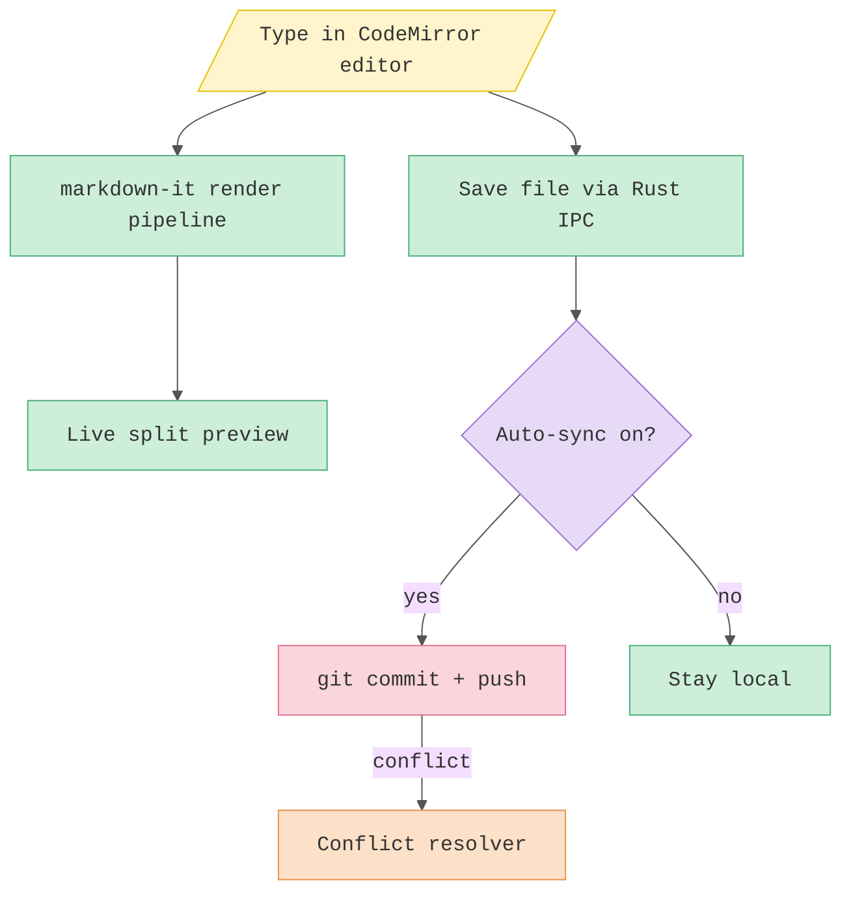

# Kaelio

**Status:** wip  ·  **Owner:** Kael (cong.bui)  ·  **Audience:** future-me + anyone picking up the codebase

Kaelio is a fast, lightweight desktop Markdown editor and project-folder reader built with Tauri 2, Rust, and vanilla TypeScript. It opens a folder, lets you read/edit/preview Markdown with live split preview, and quietly syncs your writing to Git on save. It exists because I wanted Obsidian-style note editing without launching a full IDE, and with Git-backed history baked in.

## At a glance

- **What it does:** open a folder → edit Markdown with live preview, callouts, Mermaid, math → export or auto-commit to Git on save. Soft-wrap modes and a split view (two documents side by side, with file comparison) keep long lines and multi-file work readable.
- **Who uses it:** me (Kael), for notes, specs, READMEs, journals, and project knowledge bases.
- **Stack:** Tauri 2 + Rust backend, vanilla TypeScript frontend (CodeMirror 6 + markdown-it), Catppuccin Mocha theme.

## Hero diagram

## Read next

- [Origin / why I built it](01-origin.md)
- [Timeline](02-timeline.md)
- [Architecture](03-architecture.md)
- [Lessons & gotchas](lessons.md)
