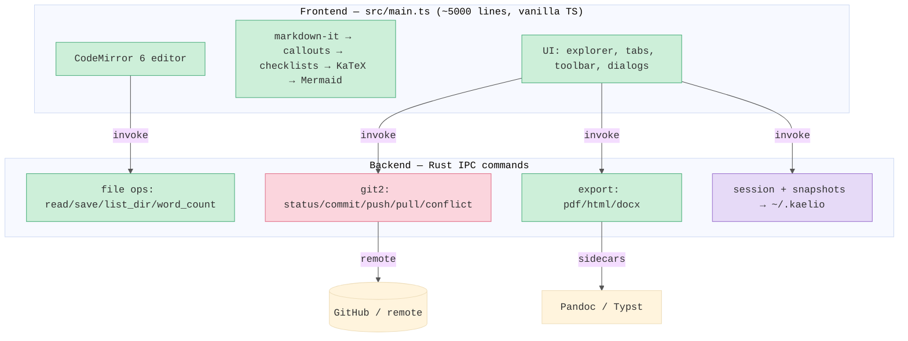

# Architecture

The deep-tech tier. How Kaelio is shaped, what runs where, and the constraints that drive the design.

## Tech stack

| Layer | Technology | Purpose |
|-------|-----------|---------|
| Shell | Tauri 2 | Native window, IPC bridge, file access, bundling |
| Frontend | Vite + vanilla TypeScript | Build tooling, HMR, all UI (no framework) |
| Editor | CodeMirror 6 | Markdown editing, history, search/replace |
| Preview | markdown-it + KaTeX + Mermaid | Live HTML rendering |
| Backend | Rust (`src-tauri/src/lib.rs`) | File I/O, Git, export, snapshots, watcher, updater menus |
| Git | git2 crate | Repo info, status, diff, log, commit, push, pull, conflict resolution |
| Export | Pandoc + Typst sidecars + preview capture | PDF / DOCX / HTML / PNG / JPG |
| Update | tauri-plugin-updater | In-app auto-update via GitHub Releases |
| CI/CD | GitHub Actions | Multi-platform build, sign, release |

## System map

> HLD only — logical flow, not node-by-node. Per-feature deep flows live in [design/](design/).

## Process model

Two processes, IPC-first: a **Rust backend** exposing commands, and a **webview frontend** (Vite dev server on `:1420`, HMR on `:1421`). The frontend never touches the filesystem directly — every file/system op goes through `invoke()` to a Rust command. No database; no network except optional remote Git and Pandoc/mermaid for export.

## Data flow — edit to preview

1. Keystroke in CodeMirror 6 fires a content-change event.
2. **300ms debounce**, then the markdown-it pipeline runs: `markdown-it → callouts → checklists → KaTeX (math) → Mermaid (diagrams) → YAML frontmatter extraction`.
3. Rendered HTML replaces the preview pane. Block tokens carry `data-source-line` for scroll-sync and click-to-cursor.
4. Save (`Cmd+S`) → `save_file` Rust command. If auto-sync is on, a fire-and-forget commit+push runs in the background.

## State & persistence

- **In-memory / module-level:** `currentFilePath`, `editor` (main CM6 instance), Git state maps (`gitStatusMap`, `gitRepoInfo`, `autoSyncEnabled`), `syncScrollEnabled`. Split view adds a second editor `editorSub` with its own `subTabs`, `subMode`, and `compareSelected`; `activePane` ("main"/"sub") routes save/focus. Wrap mode is held in a `lineWrapCompartment`.
- **localStorage:** `zoomLevel`, view mode, and a sync backup of session data.
- **`~/.kaelio/`:** `session.json` (tabs, scroll, cursor), snapshots, optional `preview.css`. Written by Rust.

## Infra / build & release

- CI matrix: macOS aarch64, Windows x86_64, Linux x86_64.
- Updater ships signed `.tar.gz` + `.sig` artifacts and a `latest.json` manifest on GitHub Releases.
- Bundled sidecars: `src-tauri/binaries/pandoc-*`, `typst-*`.
- File associations: `.md`, `.markdown`, `.yaml`, `.yml`, `.txt`, plus json/csv/html/svg/images for viewing.

## Key design constraints

- **IPC-first, no Node in frontend** — keeps the security surface small and the frontend a pure webview.
- **Monolithic frontend** — the entire UI is one `src/main.ts`. Intentional simplicity for a solo project; the cost is navigation (use search, orient by section).
- **Non-blocking Git** — sync is fire-and-forget so saves never stall on the network.
- **Catppuccin Mocha** theme via CSS variables (`--bg: #1e1e2e`, `--accent: #89b4fa`); any new UI must fit it.
- **Preview-faithful export** — PDF/DOCX favor capturing the rendered preview so output matches what's on screen; the Pandoc/Typst path remains for structured exports.

## See also

- [Reference](reference/README.md) — setup, release how-to, glossary, storage layout.
- [design/](design/) — per-feature design docs.
- [lessons.md](lessons.md) — gotchas.
